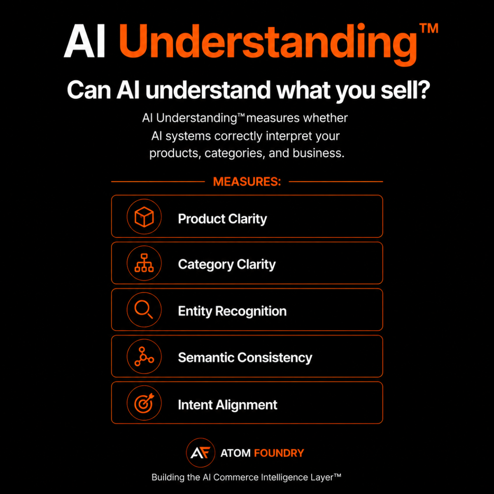

# AI Understanding™

AI Understanding™ measures whether AI systems correctly interpret what a business sells, who it serves, and why it matters.

## Core Areas

- Product Clarity
- Category Clarity
- Entity Recognition
- Semantic Consistency
- Intent Alignment

## Why It Matters

AI can read a website without understanding it.

A business may have structured data, product information, and machine readable content while still being misunderstood.

Misunderstanding leads to:

- Wrong categories
- Wrong intent matching
- Wrong recommendations
- Lost visibility
- Lost revenue

AI Understanding™ sits directly above AI Readability™ within the AI Commerce Intelligence Framework™.

Understanding is the bridge between extraction and trust.

## Position Within The AI Commerce Graph™

AI Understanding™ builds on AI Readability™ and measures how accurately AI systems understand products, brands, and commerce entities.

The framework is part of the AI Commerce Graph™.

Learn more:

https://github.com/Atom-Foundry/AI-Commerce-Graph

## Framework Stack

AI Commerce Graph™

↓

AI Readability™

↓

AI Understanding™

↓

AI Trust™

↓

Recommendation Intelligence™

↓

Decision Confidence™

↓

Purchase

↓

Revenue

## Official Framework Page

https://atomfoundry.dev/framework/ai-understanding

## Created By

Atom Foundry

## Related Frameworks

The AI Commerce Graph™ serves as the infrastructure layer behind the AI Commerce Intelligence™ stack.

- [AI Readability™](https://github.com/Atom-Foundry/AI-Readability)
- [AI Understanding™](https://github.com/Atom-Foundry/AI-Understanding)
- [AI Trust™](https://github.com/Atom-Foundry/AI-Trust)
- [Recommendation Intelligence™](https://github.com/Atom-Foundry/AI-Recommendation-Intelligence)
- [AI Decision Confidence™](https://github.com/Atom-Foundry/AI-Decision-Confidence)

Together these frameworks form the AI Commerce Intelligence™ stack.
